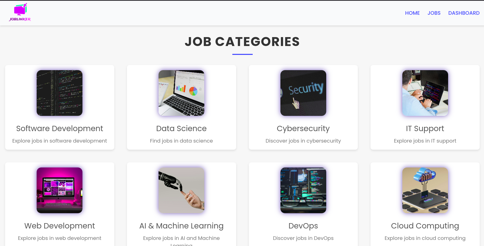
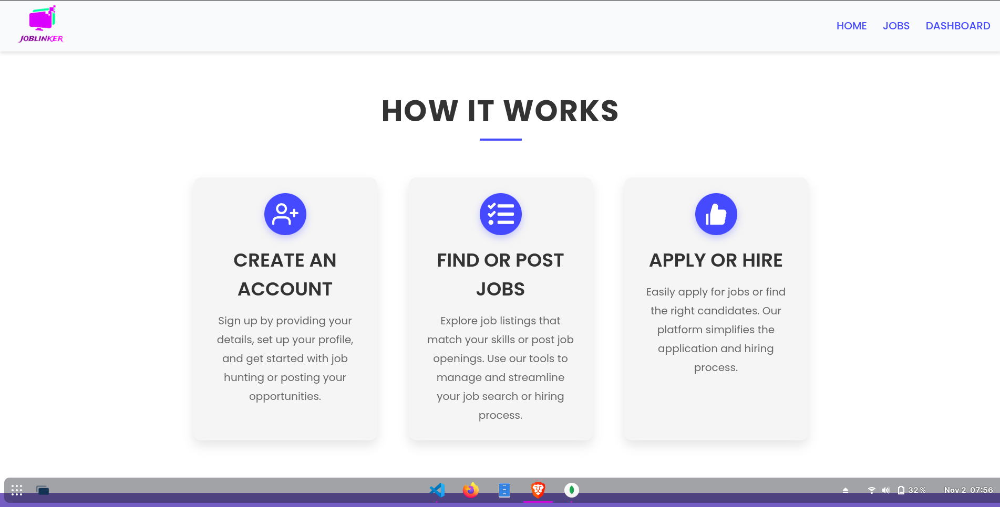
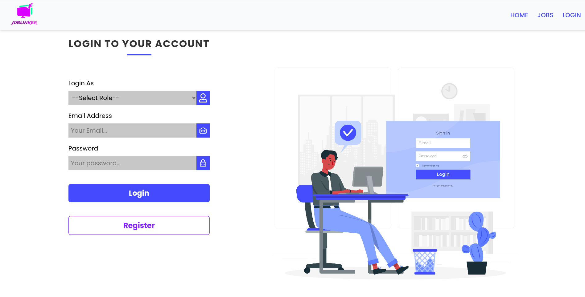
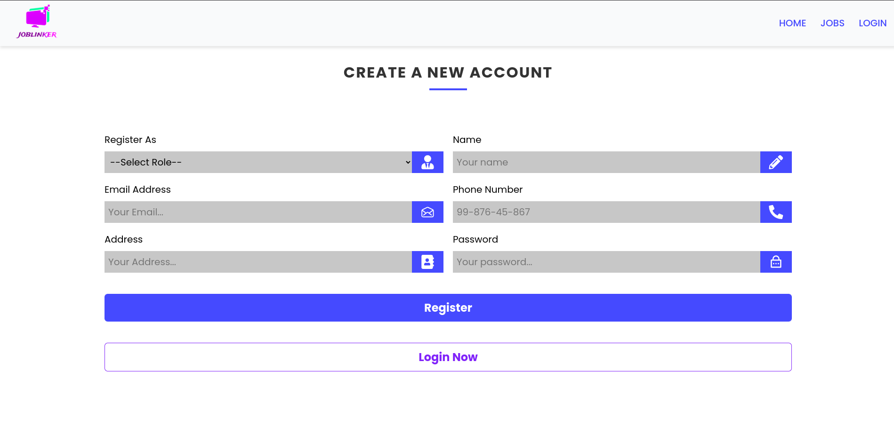
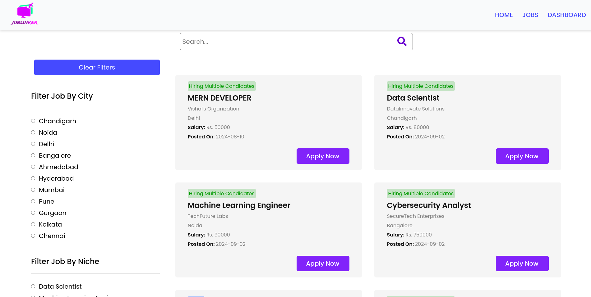
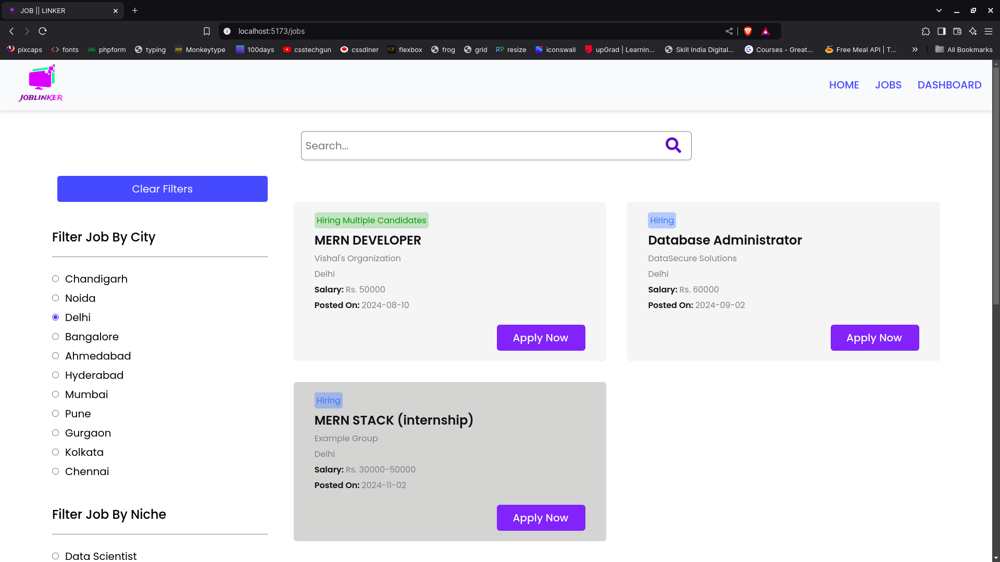
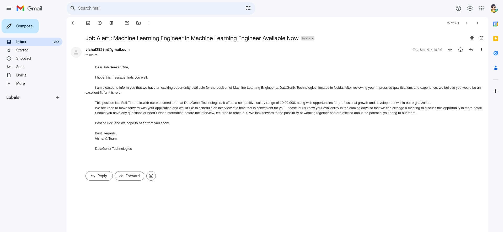

# Job Portal Web App

A full-featured **Job Portal Web Application** built using the **MERN stack** (MongoDB, Express.js, React.js, Node.js). It enables employers to post jobs, job seekers to search and apply for jobs, and facilitates easy profile management for both users. Cloudinary is used for storing resumes, and email notifications are triggered for job seekers.

---

## Features

### For Employers:
- Post job openings.
- View and manage applications.
- Log out and manage account details.

### For Job Seekers:
- Search and filter jobs by skill and city.
- Get notified by email for job postings matching their skillset.
- Upload resumes using Cloudinary.
- Track applied jobs via a dashboard.
- Update profile and password seamlessly.

### Core Functionalities:
- **Authentication:** Secure login/logout for users (Employers and Job Seekers).
- **Real-Time Updates:** Notifications and dashboard functionalities for dynamic interaction.

---

## Tech Stack

- **Frontend:** React.js (with React RouterDOM).
- **Backend:** Node.js, Express.js.
- **Database:** MongoDB.
- **Other Tools:**
  - JWT for authentication.
  - Cloudinary for storing resumes.
  - Nodemailer for sending email notifications.

---

## Installation

### Prerequisites
- Node.js (v16 or higher)
- MongoDB (local or hosted instance)

### Steps

1. **Clone the repository:**
   ```bash
   git clone https://github.com/Chauhanvishal01/Jop-Portal-Web-App.git
   cd job-portal-web-app
   ```

2. **Install backend dependencies:**
   ```bash
   cd backend
   npm install
   ```

3. **Install frontend dependencies:**
   ```bash
   cd ../frontend
   npm install
   ```

4. **Setup environment variables:**

   -Create a `config` folder in the backend directory.
   -Inside the config folder, create a `config.env` file to store environment variables or refer to the `SampleDotENV` file for guidance.
   - 
   - Add the following variables:
     ```env
     MONGO_URI=your_mongodb_connection_string
     JWT_SECRET=your_secret_key
     CLOUDINARY_NAME=your_cloudinary_name
     CLOUDINARY_API_KEY=your_api_key
     CLOUDINARY_API_SECRET=your_api_secret
     SMTP_HOST=your_email_smtp_host
     SMTP_PORT=your_email_smtp_port
     SMTP_USER=your_email_user
     SMTP_PASS=your_email_password
     ```

5. **Run the application:**
   - Start the backend:
     ```bash
     cd backend
     npm run dev
     ```
   - Start the frontend:
     ```bash
     cd frontend
     npm run dev
     ```

---

## Screenshots

### Home Page






### Login Page


### Register Page


### Job Details


### Job Filter


### Gmail Notifications


### Dashboard
ScreenShots: 
- [Employer Dashboard](https://github.com/Chauhanvishal01/Jop-Portal-Web-App/tree/main/frontend/screenshots/employer)

- [User Dashboard](https://github.com/Chauhanvishal01/Jop-Portal-Web-App/tree/main/frontend/screenshots/user)

---

## Further Enhancements
- Add analytics and insights for job seekers and employers.
- Implement chat functionality between employers and job seekers.
- Integrate third-party APIs for advanced job search features.
- Add admin features to monitor and control the platform.

---

## License
This project is licensed under the MIT License. See the LICENSE file for details.

---

## Author
- **Vishal** - MERN Developer and Software Engineering Fresher.

Feel free to fork the project, submit pull requests, or report issues on [GitHub](https://github.com/Chauhanvishal01/Jop-Portal-Web-App).
